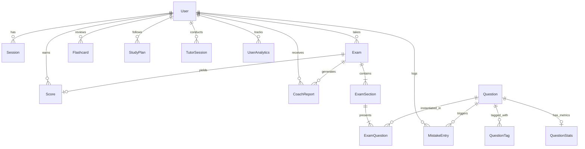

# GMAT Focus Edition — AI-Powered Adaptive Preparation Platform

[](https://turbo.build/)
[](https://nextjs.org/)
[](https://react.dev/)
[](https://nestjs.com/)
[](https://www.prisma.io/)
[](https://www.typescriptlang.org/)

An enterprise-grade, high-fidelity prep platform specifically engineered for the **GMAT Focus Edition**. Combining real-world official test constraints with cutting-edge psychometric modeling (3-Parameter Logistic Item Response Theory) and an autonomous multi-model AI pipeline (DeepSeek, NVIDIA Nemotron, Zhipu GLM, Moonshot Kimi).

---

## 📑 Table of Contents

1. [Overview & Core Value Proposition](#-overview--core-value-proposition)
2. [Platform Features](#-platform-features)
   - [1. Official GMAT Focus Exam Simulator](#1-official-gmat-focus-exam-simulator)
   - [2. Psychometric Engine (3PL Item Response Theory)](#2-psychometric-engine-3pl-item-response-theory)
   - [3. Multi-Model AI Orchestrator & Agents](#3-multi-model-ai-orchestrator--agents)
   - [4. Socratic AI Tutor (5 Pedagogical Modes)](#4-socratic-ai-tutor-5-pedagogical-modes)
   - [5. Intelligent Error Log & Mistake Book](#5-intelligent-error-log--mistake-book)
   - [6. Spaced Repetition Flashcards (SM-2 + Leitner)](#6-spaced-repetition-flashcards-sm-2--leitner)
   - [7. Dynamic Study Planner](#7-dynamic-study-planner)
   - [8. Diagnostic Coach Reports & Analytics](#8-diagnostic-coach-reports--analytics)
   - [9. Comprehensive Question Bank & Practice Modes](#9-comprehensive-question-bank--practice-modes)
3. [Architecture & Monorepo Structure](#-architecture--monorepo-structure)
4. [Technology Stack](#-technology-stack)
5. [Data Models & Schema](#-data-models--schema)
6. [Getting Started & Installation](#-getting-started--installation)
7. [Environment Configuration](#-environment-configuration)
8. [API Endpoint Reference](#-api-endpoint-reference)
9. [Related Documentation](#-related-documentation)

---

## 🌟 Overview & Core Value Proposition

The **GMAT Focus Edition** represents the biggest shift in graduate business school admissions testing in decades:
* Sentence Correction and Analytical Writing Assessment (AWA) have been eliminated.
* Geometry has been completely removed from Quantitative Reasoning.
* **Data Insights (DI)** is now an equal, fully scored section contributing 1/3 of the total score.
* Total scaled scores range from **205 to 805** (in 10-point increments), and section scores range from **60 to 90**.
* Test takers can select their section order from any of the **6 possible permutations**.
* Students can bookmark, review, and edit up to **3 answers per section** before time expires.
* A single optional **10-minute break** is offered between section 1 and 2, or section 2 and 3.

This platform replicates these exact exam conditions down to pixel and millisecond fidelity, while supercharging student preparation with adaptive psychometrics, targeted error reflection, spaced repetition, and 24/7 Socratic AI coaching.

---

## 🚀 Platform Features

### 1. Official GMAT Focus Exam Simulator
* **Complete Section Coverage**:
  * **Quantitative Reasoning**: 21 questions, 45 minutes (Arithmetic, Algebra, Number Properties, Word Problems, Statistics; 0 geometry).
  * **Verbal Reasoning**: 23 questions, 45 minutes (Critical Reasoning, Reading Comprehension with synchronized split-view passages).
  * **Data Insights**: 20 questions, 45 minutes (Data Sufficiency, Table Analysis with sortable columns, Multi-Source Reasoning with multi-tab sources, Graphics Interpretation, Two-Part Analysis matrix radio selectors).
* **Section Order Customization**: Choose from all 6 official permutations prior to starting:
  * Q-V-DI, Q-DI-V, V-Q-DI, V-DI-Q, DI-Q-V, or DI-V-Q.
* **Server-Authoritative Test Timer**:
  * Absolute UTC deadlines (`sectionDeadlineAt`) enforced by the backend server; late submissions are rejected with HTTP 400.
  * Real-time client timer synchronized via `/api/v1/exams/:id/sync` with 30s drift compensation heartbeats.
  * Visual pacing alerts: 5-minute caution (yellow) and 1-minute urgent (red pulsing) thresholds.
* **Strict 3-Edit Review Enforcement**:
  * Server-authoritative quota (`editsRemaining`) initialized to 3 per section.
  * Modifying an answer atomically decrements the quota in database; attempts to alter a 4th answer are rejected by both frontend and backend.
* **Single Break Engine**:
  * One optional 10-minute break allowed after Section 1 or Section 2.
  * Server state machine transitions `IN_PROGRESS` $\leftrightarrow$ `ON_BREAK` via dedicated `/break/start` and `/break/end` endpoints with 600-second deadline enforcement.
* **Append-Only Event Ledger (`ExamEvent`)**:
  * Tracks every test-delivery event (`EXAM_STARTED`, `SECTION_STARTED`, `ANSWER_SUBMITTED`, `BREAK_STARTED`, `BREAK_ENDED`, `SECTION_COMPLETED`) with sequence numbering and idempotency keys.
* **Interactive Tooling**:
  * Built-in on-screen calculator provided exclusively during the Data Insights section.

### 2. Psychometric Engine (3PL Item Response Theory)
* **Mathematical 3-Parameter Logistic (3PL) Model**:
  $$P(\theta) = c + \frac{1 - c}{1 + e^{-a(\theta - b)}}$$
  * $b$ = Item Difficulty parameter.
  * $a$ = Item Discrimination parameter.
  * $c$ = Pseudo-guessing parameter (fixed at 0.20 for 5-choice multiple choice).
* **Calibrated Fisher Information Formula (Lord's 3PL)**:
  $$I(\theta) = a^2 \cdot \frac{1 - P(\theta)}{P(\theta)} \cdot \left(\frac{P(\theta) - c}{1 - c}\right)^2$$
  * Correct mathematical formulation ensuring information peaks at item difficulty $b$ and correctly decays to 0 as $\theta \to \infty$.
* **Bayesian Expected A Posteriori (EAP) Ability Estimation**:
  * Quadrature numerical integration over $[-3.0, 3.0]$ with standard normal prior $\mathcal{N}(0, 1)$ to prevent divergent MLE estimations on all-correct or all-wrong response strings.
* **Content & Topic Balancing**:
  * Constrained shadow-selection ensuring balanced topic distribution across all tested subjects within each section.
* **Official Scale Calibration & Score Uncertainty**:
  * Theta-to-score projection mapping $\theta \in [-3.0, 3.0]$ to section scores ($60-90$) and aggregate total scores ($205-805$ in 10-point increments strictly ending in 5: 205, 215, 225, ..., 805).
  * Reports Standard Error of Measurement (SEM) and 95% Confidence Intervals with an explicit disclaimer distinguishing simulator estimates from official GMAC scores.

### 3. Multi-Model AI Orchestrator & Agents
A decoupled, vendor-agnostic architecture assigning specialized AI models to distinct cognitive tasks via standard environment variables:
* **Question Generation Agent**: Powered by **DeepSeek-V3 / DeepSeek-R1** for complex quantitative and critical reasoning problem synthesis without copyright replication.
* **Psychometric Validation Agent**: Powered by **NVIDIA Nemotron** to critique, score (0–100), and verify correctness, distractors, logical validity, and psychometric discrimination before questions are admitted to the pool.
* **Explanation Synthesis Agent**: Powered by **GLM-4** to generate multi-faceted explanations (formal step-by-step, fastest shortcut, alternative method, and distractor post-mortems).
* **Embedding Model**: Configured with **BGE-M3** for vector indexing and semantic retrieval of question concepts in Qdrant.
* **Local Offline Fallback**: Fully compatible with **Ollama** (`llama3.1`) for local offline operation without external API dependencies.

### 4. Socratic AI Tutor (5 Pedagogical Modes)
Interactive, context-aware AI tutor capable of rendering mathematical equations in formatted LaTeX ($...$ and $$...$$ via KaTeX) and operating in five tailored personas:
1. **Beginner**: Deconstructs problems from foundational first principles; explains underlying arithmetic/algebra without skipping steps.
2. **Intermediate**: Balances formal mathematical solutions with time-saving GMAT heuristics and common trap avoidance.
3. **Expert**: Advanced 700+ level meta-strategies, edge-case logic, and extreme speed optimization.
4. **Visual**: Formats explanations with ASCII diagrams, Markdown tables, and structured logic trees.
5. **Coach**: Acts as a motivational mentor, advising on time management, stress reduction, pacing, and study schedule adjustments.

### 5. Intelligent Error Log & Mistake Book
* **Automatic Exam Capture**: Any question skipped or answered incorrectly during a practice session or mock exam is automatically ingested into the student's Error Log.
* **Error Taxonomy**: Categorizes errors into five root causes:
  * `CONCEPTUAL`: Lack of knowledge regarding formulas, grammar rules, or logic frameworks.
  * `CALCULATION`: Arithmetic or algebraic execution error.
  * `READING`: Misreading the question stem, misinterpreting constraints, or falling for word traps.
  * `TIME_PRESSURE`: Rushing or guessing due to dwindling section clock.
  * `CARELESS`: Overlooking details or entering the wrong answer choice.
* **AI-Powered "Generate Flashcard" Action**: One-click conversion of any error entry into a conceptual spaced repetition flashcard distilling the underlying principle.

### 6. Spaced Repetition Flashcards (SM-2 + Leitner)
* **Hybrid Algorithm**:
  * **SuperMemo SM-2**: Tracks individual card ease factors ($EF \ge 1.3$), repetition counts, and exponential review intervals.
  * **5-Box Leitner System**: Organizes mastery visually into Boxes 1 through 5 (1 day $\rightarrow$ 3 days $\rightarrow$ 7 days $\rightarrow$ 14 days $\rightarrow$ 30 days).
* **Interactive 3D Card Deck**: Flip card animation with KaTeX rendering for formulas and answer rationales.
* **Self-Assessment Rating**: 0–5 quality scoring (`Again`, `Hard`, `Good`, `Easy`) directly recalibrating card memory retention curves.

### 7. Dynamic Study Planner
* **Target-Driven Generation**: Generates customized daily study roadmaps based on:
  * Baseline / current score vs. target score (e.g. 585 $\rightarrow$ 705).
  * Target exam date (calculates total available calendar days).
  * Available study hours per day.
* **Structured Daily Task Mix**:
  * Topic practice, error reviews, flashcard decks, Socratic tutoring check-ins, and full-length mock exams.
* **Task Checklist & State Persistence**: Track completed tasks day-by-day towards target milestones.

### 8. Diagnostic Coach Reports & Analytics
* **Executive Performance Dashboard**:
  * Total exams completed, overall average score, current daily streak, and questions solved today.
* **Score Progression & Trendlines**: Historical tracking across exam dates.
* **Topic Accuracy & Weakness Matrix**: Highlights areas of strength ($\ge 70\%$ accuracy) vs. critical vulnerability ($< 70\%$) across Quant, Verbal, and DI.
* **On-Demand AI Coach Diagnostics**: Synthesis of executive summary, projected test-day score, milestone improvement timeline, and customized study directives.

### 9. Comprehensive Question Bank & Practice Modes
* **Multi-Attribute Filtering**:
  * Section (`QUANTITATIVE`, `VERBAL`, `DATA_INSIGHTS`).
  * Difficulty level (205 through 805).
  * Topic and subtopic.
  * Full-text search across question stems.
* **Interactive Solution Viewer**: Instant on-demand practice with collapsible solution breakdowns, faster alternate methods, and distractor analysis.

---

## 🏗 Architecture & Monorepo Structure

The project is structured as a **Turborepo monorepo** utilizing **pnpm workspaces**:

```
d:/GMAT
├── apps
│   ├── api                       # NestJS 11 Backend API Service
│   │   ├── src
│   │   │   ├── main.ts           # Global prefix /api/v1, CORS, ValidationPipe
│   │   │   ├── app.module.ts     # Root module configuring config, throttler, submodules
│   │   │   └── modules
│   │   │       ├── ai            # AI Orchestrator, Question Gen, Validation, Explanations
│   │   │       ├── analytics     # Dashboard metrics, topic performance, coach reports
│   │   │       ├── auth          # JWT auth, register, login, Passport strategies & guards
│   │   │       ├── exam          # Exam creation, answer submit, 3-edit review, scoring
│   │   │       ├── flashcards    # SM-2 + Leitner flashcards, review cycle, AI converter
│   │   │       ├── irt           # 3PL IRT engine, EAP ability estimation, Fisher MFI
│   │   │       ├── mistakes      # Mistake book, error taxonomy, auto-capture
│   │   │       ├── prisma        # Prisma ORM connection service
│   │   │       ├── questions     # Question repository, filtering, batch generation
│   │   │       ├── study-plan    # Dynamic study roadmap engine
│   │   │       └── tutor         # Socratic AI tutor session management
│   │   └── package.json
│   │
│   └── web                       # Next.js 16 (React 19) Frontend Application
│       ├── src
│       │   ├── app
│       │   │   ├── layout.tsx    # Root layout with fonts, theme, FetchInterceptor
│       │   │   ├── globals.css   # Modern dark design system & animation tokens
│       │   │   ├── page.tsx      # Landing page, value prop, feature showcase
│       │   │   ├── auth/         # Login & Register views
│       │   │   ├── dashboard/    # Protected student portal (layout + 8 subviews)
│       │   │   └── exam/         # Full-screen exam simulator ([id], new, results)
│       │   └── components
│       │       └── FetchInterceptor.tsx # Injects Bearer JWT token into client requests
│       └── package.json
│
├── packages
│   ├── database                  # Database layer
│   │   ├── prisma
│   │   │   ├── schema.prisma     # Complete Prisma schema
│   │   │   ├── seed.ts           # Demo users & initial validated GMAT question pool
│   │   │   └── dev.db            # SQLite local database instance
│   │   └── package.json
│   │
│   └── shared                    # Cross-workspace TypeScript definitions & constants
│       ├── src
│       │   ├── constants.ts      # Section timings, question counts, IRT bounds, Leitner
│       │   ├── types.ts          # Core data contracts, enums, DTOs
│       │   └── index.ts
│       └── package.json
│
├── docker-compose.yml            # PostgreSQL 15, Redis 7, Qdrant vector DB services
├── package.json                  # Root monorepo scripts & dependencies
├── turbo.json                    # Turborepo pipeline caching configuration
├── pnpm-workspace.yaml           # Workspace package boundaries
└── .env.example                  # Environment configuration template
```

---

## 🛠 Technology Stack

| Layer | Technology | Version | Purpose |
| :--- | :--- | :--- | :--- |
| **Monorepo** | Turborepo | ^2.4.0 | Build orchestration, incremental task caching |
| **Package Manager**| pnpm | 9.15.0 | Workspace resolution and symlinked dependency management |
| **Frontend Framework** | Next.js (App Router) | 16.2.9 | Modern React server/client architecture, SSR, routing |
| **UI Library** | React | 19.2.4 | Modern reactive user interfaces |
| **Styling** | Vanilla CSS + Tailwind CSS | ^4.0.0 | Premium dark-mode design system with glassmorphism |
| **Icons & Motion** | Lucide React + Framer Motion | Latest | Consistent icon set and physics-based micro-interactions |
| **Math Typesetting** | KaTeX | ^0.16.21 | Mathematical LaTeX rendering for formulas and questions |
| **Visual Charts** | Recharts | ^2.15.0 | Responsive analytics charts (radar, bar, area, line) |
| **Backend Framework** | NestJS | ^11.0.1 | Scalable, modular enterprise TypeScript backend |
| **ORM** | Prisma | ^6.2.0 | Type-safe database queries and migrations |
| **Primary Database** | SQLite (Dev) / PostgreSQL (Prod) | 15 (Docker) | Relational persistence of users, questions, exams |
| **Cache & Queues** | Redis | 7 (Docker) | Session state and fast lookups |
| **Vector Database** | Qdrant | Latest | Semantic question search and RAG embeddings |
| **Authentication** | Passport-JWT + bcryptjs | Latest | Stateless Bearer token security and password hashing |

---

## 📊 Data Models & Schema

The data model is defined in [`packages/database/prisma/schema.prisma`](file:///d:/GMAT/packages/database/prisma/schema.prisma):



### Key Models
1. **User**: Stores profile, role (`STUDENT`, `TUTOR`, `ADMIN`, `INSTITUTE`), and hashed credentials.
2. **Exam & ExamSection**: Tracks test state (`NOT_STARTED`, `IN_PROGRESS`, `ON_BREAK`, `COMPLETED`), chosen section order, ability estimate, remaining edits (max 3), and time remaining.
3. **ExamQuestion**: Relates exam instances to static questions, recording chosen answers, flagged status, time taken (seconds), and edit history.
4. **Question**: Stores stem, passage, options, correct answer, explanation JSON, section, topic, subtopic, difficulty (205–805), and IRT parameters ($a, b, c$).
5. **Score**: GMAT Focus scores (Quant 60–90, Verbal 60–90, DI 60–90, Total 205–805, and calculated percentile).
6. **Flashcard**: Front/back content, 5-box Leitner category, and SM-2 variables ($EF$, interval, repetitions, next review timestamp).
7. **MistakeEntry**: Error classification (`CONCEPTUAL`, `CALCULATION`, `READING`, `TIME_PRESSURE`, `CARELESS`), student reflections, and auto-capture origin.
8. **TutorSession**: Socratic chat history, persona configuration, and context snapshots.

---

## ⚡ Getting Started & Installation

### Prerequisites
* **Node.js**: `>= 20.0.0`
* **pnpm**: `>= 9.0.0`
* **Docker & Docker Compose** (Optional, for running PostgreSQL, Redis, Qdrant)

### Step 1: Clone and Install Dependencies
```bash
git clone <repository-url>
cd GMAT
pnpm install
```

### Step 2: Configure Environment
Copy `.env.example` to `.env` in the workspace root:
```bash
cp .env.example .env
```
*(For local development, SQLite is enabled out-of-the-box via `DATABASE_URL="file:./dev.db"`).*

### Step 3: Initialize Database & Seed Question Pool
```bash
# Generate Prisma Client
pnpm db:generate

# Push schema to SQLite
pnpm db:push

# Seed admin/student users and starter question pool
pnpm db:seed
```

### Step 4: Run the Development Server
```bash
pnpm dev
```
Turborepo will launch both services in parallel:
* **Web Application**: [http://localhost:3000](http://localhost:3000)
* **Backend API Gateway**: [http://localhost:3001](http://localhost:3001)
* **API Health Check**: [http://localhost:3001/api/v1/health](http://localhost:3001/api/v1/health)

### Default Test Credentials (from Seed)
* **Student User**: `student@gmatprep.ai` / `password123`
* **Admin User**: `admin@gmatprep.ai` / `password123`

---

## ⚙ Environment Configuration

| Variable | Description | Default |
| :--- | :--- | :--- |
| `DATABASE_URL` | SQLite / PostgreSQL connection URI | `file:./dev.db` |
| `REDIS_URL` | Redis connection URL | `redis://localhost:6379` |
| `AUTH_SECRET` | Secret key for JWT signing | *(random string)* |
| `API_PORT` | Backend NestJS listening port | `3001` |
| `WEB_PORT` | Frontend Next.js listening port | `3000` |
| `AI_QUESTION_GENERATION_PROVIDER`| Provider for question generation | `deepseek` |
| `AI_VALIDATION_PROVIDER` | Provider for psychometric validation | `nemotron` |
| `AI_EXPLANATION_PROVIDER` | Provider for explanations | `glm` |
| `AI_TUTOR_PROVIDER` | Provider for Socratic AI tutoring | `kimi` |
| `AI_EMBEDDING_PROVIDER` | Provider for vector embeddings | `bge` |
| `AI_DEEPSEEK_API_KEY` | DeepSeek API key | `""` |
| `AI_NEMOTRON_API_KEY` | NVIDIA NIM API key | `""` |
| `AI_GLM_API_KEY` | Zhipu AI GLM key | `""` |
| `AI_KIMI_API_KEY` | Moonshot Kimi API key | `""` |
| `AI_OLLAMA_BASE_URL` | Local Ollama endpoint | `http://localhost:11434` |

---

## 📡 API Endpoint Reference

All endpoints are served under the global prefix `/api/v1`:

### Authentication (`/auth`)
* `POST /auth/register` — Create new student account.
* `POST /auth/login` — Authenticate and retrieve JWT bearer token.
* `GET /auth/me` — Retrieve current authenticated user profile (`Bearer JWT` required).

### Exam Engine (`/exams`)
* `POST /exams` — Initialize a new practice or adaptive CAT exam with section order.
* `GET /exams` — List user's past exam attempts.
* `GET /exams/:id` — Fetch complete exam state, sections, and question instances.
* `POST /exams/:id/sections/:sectionId/answer` — Submit an answer and trigger dynamic IRT theta recalculation.
* `POST /exams/questions/:examQuestionId/flag` — Toggle bookmark flag on question.
* `POST /exams/:id/sections/:sectionId/complete` — Complete a section, calculate section score (60–90), and advance to break or next section.
* `POST /exams/:id/complete` — Finalize exam, calculate total score (205–805), percentiles, and trigger mistake auto-capture.

### Question Bank (`/questions`)
* `GET /questions` — Query questions by section, difficulty, topic, search query, and pagination.
* `GET /questions/:id` — Retrieve full question details with explanations.
* `POST /questions/generate` — Trigger on-demand AI question generation and validation.

### Spaced Repetition Flashcards (`/flashcards`)
* `GET /flashcards` — Fetch flashcards with optional section and type filters.
* `GET /flashcards/due` — Retrieve cards scheduled for review today.
* `POST /flashcards` — Create custom flashcard.
* `POST /flashcards/:id/review` — Submit 0–5 quality rating, executing SM-2 and Leitner interval update.
* `POST /flashcards/generate-from-mistake` — AI synthesizes a conceptual flashcard from a Mistake Book entry.
* `DELETE /flashcards/:id` — Delete a flashcard.

### Error Log / Mistake Book (`/mistakes`)
* `GET /mistakes` — List user mistake entries with filters (`section`, `errorType`).
* `GET /mistakes/:id` — Retrieve individual mistake detail with linked question.
* `POST /mistakes` — Add an error entry manually.
* `PATCH /mistakes/:id` — Update error classification, reflections, and tags.
* `DELETE /mistakes/:id` — Remove an entry from the mistake log.

### Socratic AI Tutor (`/tutor`)
* `POST /tutor/sessions` — Start new tutoring session in specified mode (`BEGINNER`, `INTERMEDIATE`, `EXPERT`, `VISUAL`, `COACH`).
* `GET /tutor/sessions` — List all past tutor sessions.
* `GET /tutor/sessions/:id` — Retrieve messages for a session.
* `POST /tutor/sessions/:id/messages` — Send user message and stream/receive AI response.

### Analytics & Reports (`/analytics`)
* `GET /analytics/dashboard` — Retrieve dashboard KPIs, score trends, topic accuracies, and streak counts.
* `GET /analytics/reports` — List generated diagnostic coach reports.
* `POST /analytics/reports` — Trigger synthesis of a new comprehensive AI coach report.

### Study Plans (`/study-plan`)
* `POST /study-plan` — Generate new active study plan from target score and exam date.
* `GET /study-plan/active` — Fetch current active study plan.
* `PATCH /study-plan/:id` — Update tasks and completion states.

---

## 📖 Related Documentation

* [`decisions.md`](file:///d:/GMAT/decisions.md) — Comprehensive Architecture Decision Record (ADR) detailing architectural choices, library selections, and design rationales.
* [`flow.md`](file:///d:/GMAT/flow.md) — Deep-dive execution and control flow documentation tracing execution order from request initiation to database commit.
