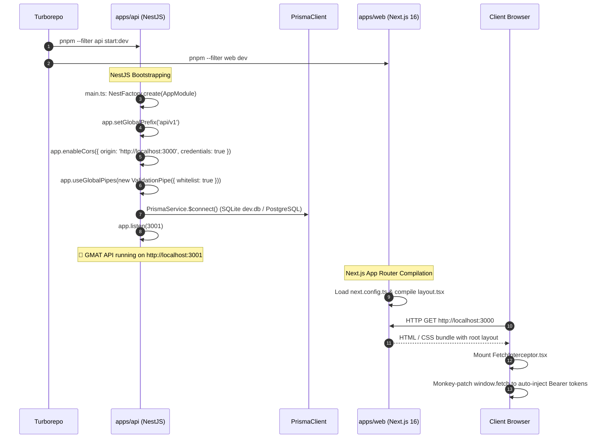
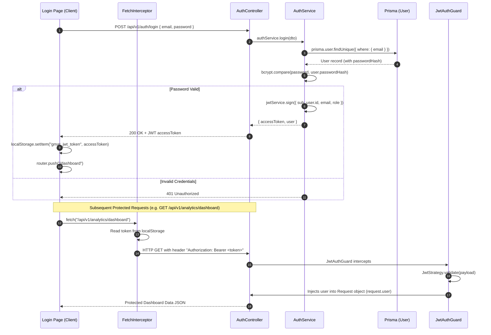
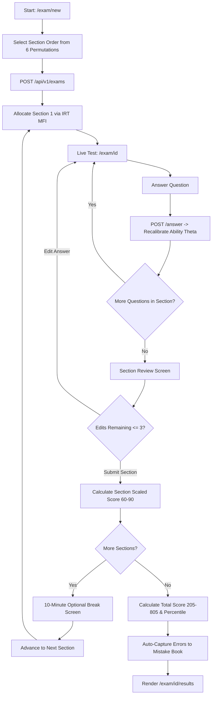
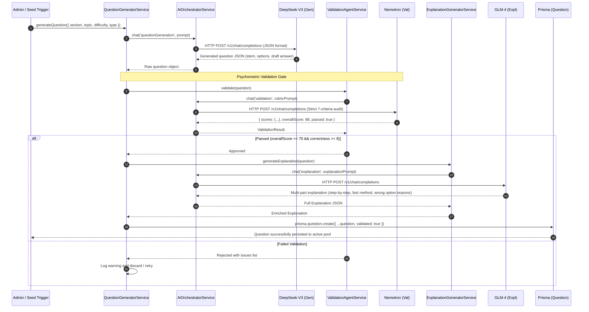
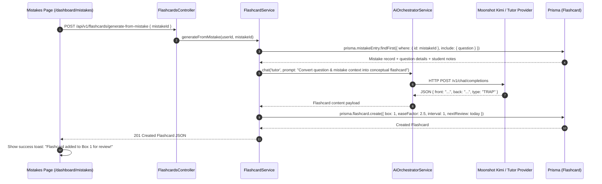
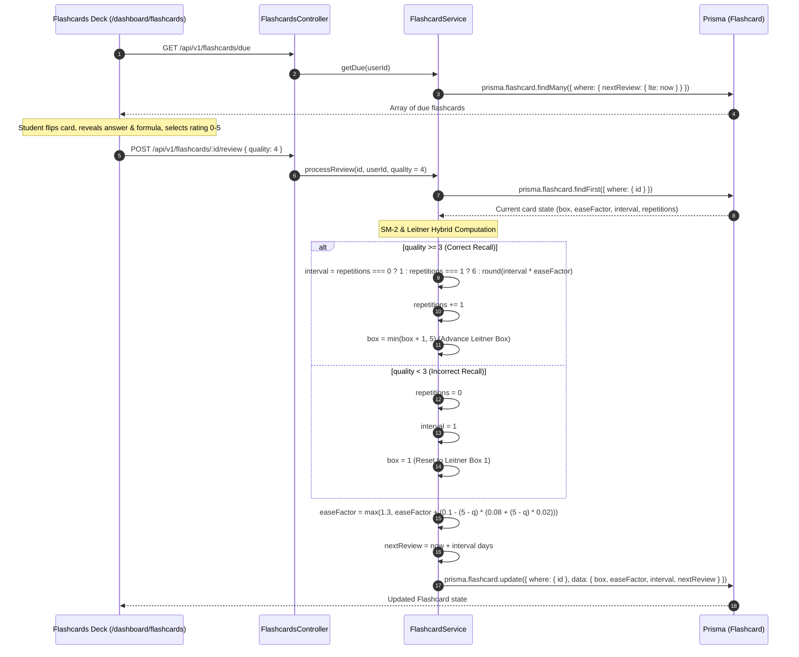
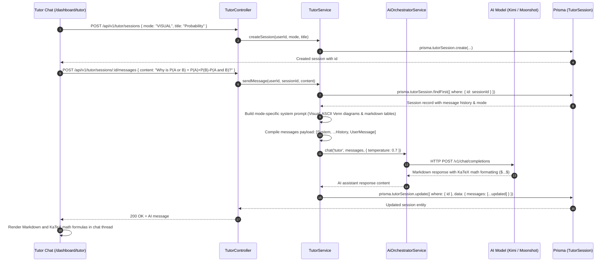
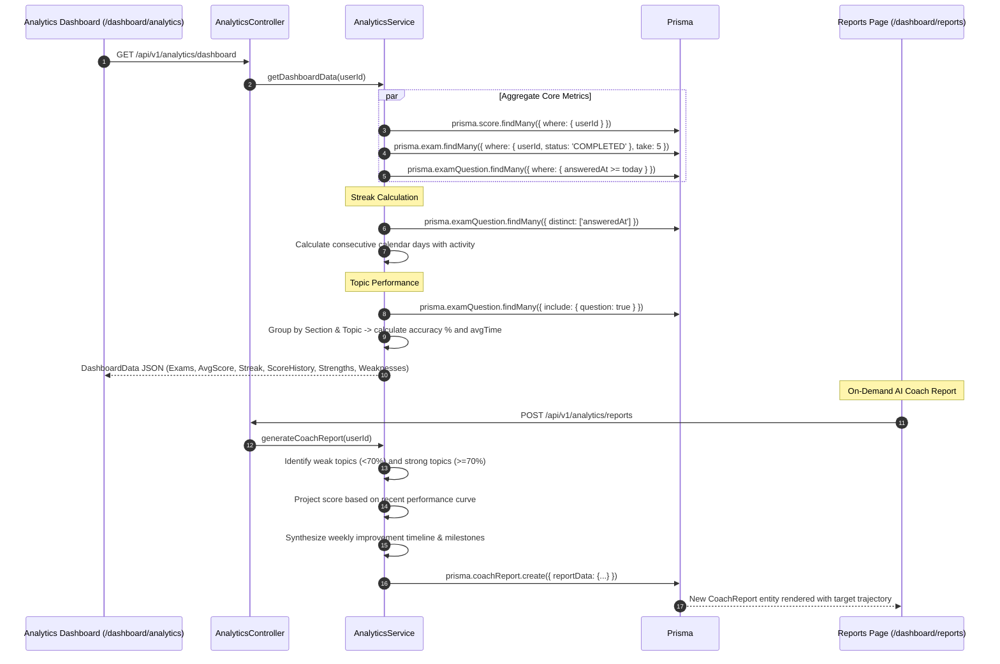

# System Execution & Control Flow Documentation

This document provides an exhaustive, chronological trace of execution flows across the **GMAT Focus Edition Platform**. It illustrates exactly what is called, in what order, across all major runtime subsystems.

---

## 📑 Table of Contents

1. [System Startup & Bootstrapping Flow](#1-system-startup--bootstrapping-flow)
2. [Authentication & Request Interception Flow](#2-authentication--request-interception-flow)
3. [Full GMAT Focus Exam Execution Lifecycle](#3-full-gmat-focus-exam-execution-lifecycle)
   - [Phase 3.1: Exam Configuration & Initiation](#phase-31-exam-configuration--initiation)
   - [Phase 3.2: Question Allocation & Initial IRT Selection](#phase-32-question-allocation--initial-irt-selection)
   - [Phase 3.3: Live Test Interface Rendering](#phase-33-live-test-interface-rendering)
   - [Phase 3.4: Answering & Dynamic IRT Ability Recalibration](#phase-34-answering--dynamic-irt-ability-recalibration)
   - [Phase 3.5: Navigation, Pacing & Bookmarking](#phase-35-navigation-pacing--bookmarking)
   - [Phase 3.6: Section Review Screen & 3-Edit Limit Enforcement](#phase-36-section-review-screen--3-edit-limit-enforcement)
   - [Phase 3.7: Section Completion & Scaled Scoring](#phase-37-section-completion--scaled-scoring)
   - [Phase 3.8: Optional 10-Minute Break Management](#phase-38-optional-10-minute-break-management)
   - [Phase 3.9: Final Exam Scoring & Auto-Mistake Capture](#phase-39-final-exam-scoring--auto-mistake-capture)
   - [Phase 3.10: Results & Diagnostic Report Presentation](#phase-310-results--diagnostic-report-presentation)
4. [AI Multi-Agent Generation & Validation Pipeline](#4-ai-multi-agent-generation--validation-pipeline)
5. [Error Log to Spaced Repetition Conversion Pipeline](#5-error-log-to-spaced-repetition-conversion-pipeline)
6. [Spaced Repetition Review Lifecycle (SM-2 + Leitner)](#6-spaced-repetition-review-lifecycle-sm-2--leitner)
7. [Socratic AI Tutor Interactive Session Flow](#7-socratic-ai-tutor-interactive-session-flow)
8. [Analytics Aggregation & Coach Report Generation Flow](#8-analytics-aggregation--coach-report-generation-flow)

---

## 1. System Startup & Bootstrapping Flow

When running `pnpm dev`, Turborepo starts the backend API gateway and frontend web server in parallel:

### Detailed Order of Execution:
1. **Turborepo** resolves dependencies and launches both `apps/api` and `apps/web`.
2. **NestJS (`apps/api/src/main.ts`)**:
   - Initializes `AppModule` which loads `ConfigModule` (`.env` file).
   - Instantiates database connection via `PrismaService.onModuleInit()`.
   - Sets global API route prefix to `/api/v1`.
   - Binds global `ValidationPipe` for automatic DTO transformation and whitelist validation.
   - Enables CORS for `http://localhost:3000`.
   - Listens on `API_PORT` (default 3001).
3. **Next.js (`apps/web`)**:
   - Boots Next.js 16 development server on `WEB_PORT` (default 3000).
   - Compiles server layout [`apps/web/src/app/layout.tsx`](file:///d:/GMAT/apps/web/src/app/layout.tsx).
   - Sends client bundle including [`FetchInterceptor.tsx`](file:///d:/GMAT/apps/web/src/components/FetchInterceptor.tsx).
   - `FetchInterceptor` executes in browser `useEffect()`, monkey-patching `window.fetch` to intercept any URL matching `/api/v1/*` or `http://localhost:3000/api/v1/*` and append `Authorization: Bearer <gmat_jwt_token>` from `localStorage`.

---

## 2. Authentication & Request Interception Flow

---

## 3. Full GMAT Focus Exam Execution Lifecycle

The exam lifecycle represents the most critical, complex path in the application.

### Step-by-Step Breakdown:

#### Phase 3.1: Exam Configuration & Initiation
1. Student navigates to `/exam/new`.
2. Student selects exam type (`ADAPTIVE`, `MOCK`, or `PRACTICE`) and chooses their preferred section order from the 6 official permutations (e.g. `QUANTITATIVE` $\rightarrow$ `VERBAL` $\rightarrow$ `DATA_INSIGHTS`).
3. Client dispatches `POST /api/v1/exams` with `{ type, sectionOrder }`.
4. [`ExamController.createExam()`](file:///d:/GMAT/apps/api/src/modules/exam/exam.controller.ts) delegates to [`ExamService.createExam()`](file:///d:/GMAT/apps/api/src/modules/exam/exam.service.ts).
5. `ExamService` initializes the `Exam` entity in Prisma with 3 `ExamSection` records:
   - Section 1: `status = IN_PROGRESS`, `timeRemaining = 2700` (45 min), `editsRemaining = 3`.
   - Section 2 & 3: `status = NOT_STARTED`, `timeRemaining = 2700`.

#### Phase 3.2: Question Allocation & Initial IRT Selection
1. `ExamService.allocateQuestionsForSection()` is invoked for Section 1 with initial ability $\theta = 0.0$.
2. It fetches all validated questions for the target section from Prisma.
3. It passes available questions to [`IrtService.selectQuestions()`](file:///d:/GMAT/apps/api/src/modules/irt/irt.service.ts):
   - Computes Fisher Information $I(\theta)$ for each item candidate at $\theta$.
   - Applies topic balancing constraints (e.g. balanced distribution between Arithmetic, Algebra, Word Problems).
   - Returns the optimal question sequence.
4. `ExamService` batch-inserts `ExamQuestion` records referencing the selected question IDs with ascending `orderIndex` (0 to 20 for Quant, 0 to 22 for Verbal, 0 to 19 for DI).
5. Returns exam payload to client; client navigates to `/exam/[id]`.

#### Phase 3.3: Live Test Interface Rendering & Server Clock Sync
1. [`apps/web/src/app/exam/[id]/page.tsx`](file:///d:/GMAT/apps/web/src/app/exam/[id]/page.tsx) mounts and reads `params.id`.
2. Fetches `GET /api/v1/exams/:id` and `/api/v1/exams/:id/sync`.
3. Sets authoritative `timeRemaining` based on `sectionDeadlineAt` and server timestamp delta.
4. Spawns a periodic 30-second synchronization heartbeat (`GET /api/v1/exams/:id/sections/:sectionId/sync`) to detect drift. If client drift exceeds 2 seconds, client timer re-aligns to the server deadline.
5. If the section deadline has passed on the server (`isExpired = true`), `handleSectionComplete()` is automatically triggered.

#### Phase 3.4: Answering & Dynamic IRT Ability Recalibration
1. Student selects an answer choice (e.g. Option "C").
2. Client sends `PATCH /api/v1/exams/:id/sections/:sectionId/answer` with `{ questionIndex, answer, idempotencyKey }`.
3. In `ExamService.submitAnswer()`:
   - Validates that `now <= sectionDeadlineAt`. Late submissions are rejected.
   - If this is an answer change, checks `editsRemaining > 0`. If 0, rejects the edit with HTTP 400.
   - Compares student answer with `Question.correctAnswer`.
   - Sets `ExamQuestion.userAnswer`, `isCorrect`, `isSkipped = false`, `answeredAt = new Date()`.
   - If changed, marks `isEdited = true` and decrements `ExamSection.editsRemaining`.
   - Compiles historical responses for all answered questions in the section.
   - Calls `IrtService.estimateAbility(responses)`:
     - Runs 61-point Gaussian quadrature integration between $-3.0$ and $+3.0$ with prior $\mathcal{N}(0, 1)$.
     - Evaluates 3PL likelihood:
       $$L(\theta|\mathbf{u}) = \prod [P_i(\theta)]^{u_i} [1 - P_i(\theta)]^{1 - u_i}$$
     - Calculates new Expected A Posteriori ability estimate $\hat{\theta}_{EAP}$.
   - Updates `ExamSection.abilityEstimate` with $\hat{\theta}_{EAP}$ in database.
   - Records an `ANSWER_SUBMITTED` event in `ExamEvent` ledger.
   - Returns `{ success: true, editsRemaining, isCorrect, userAnswer }` to client.

#### Phase 3.5: Navigation, Pacing & Bookmarking
1. Clicking **Next**: Computes elapsed time on current question via `Date.now() - questionStartTime`, updates accumulated `timeTaken`, and advances `currentQuestionIndex`.
2. Clicking **Bookmark / Flag**: Dispatches `PATCH /api/v1/exams/questions/:examQuestionId/flag`, toggling `isFlagged` for review filtering in both UI and database.
3. Reaching the last question in the section transitions the interface to `phase = "review"`.

#### Phase 3.6: Section Review Screen & 3-Edit Limit Enforcement
1. The **Review Screen** displays a complete grid of all questions in the section with their status: `Answered`, `Skipped`, or `Flagged`.
2. Displays prominent counter: **"Edits Remaining: X of 3"** (synchronized with server `editsRemaining`).
3. Student clicks on any question to inspect or change their response.
4. If the student changes an already-submitted answer:
   - Client and server enforce `editsRemaining > 0`.
   - If allowed, updates answer, marks `isEdited = true`, and decrements `editsRemaining`.
   - If `editsRemaining === 0`, answer modifications are rejected both on client and server.
5. Student clicks **"End Section"** to finalize.

#### Phase 3.7: Section Completion & Scaled Scoring
1. Client dispatches `POST /api/v1/exams/:id/sections/:sectionId/complete`.
2. `ExamService.completeSection()`:
   - Reads final $\hat{\theta}_{EAP}$ for the section.
   - Calls [`ScoringService.calculateSectionScore(theta)`](file:///d:/GMAT/apps/api/src/modules/exam/scoring.service.ts):
     - Linearly maps clamped $\theta \in [-3.0, 3.0]$ to official GMAT scaled range $[60, 90]$.
     - Rounds to nearest integer.
   - Marks section as `SectionStatus.COMPLETED` with timestamp and score.
   - If more sections remain in the chosen order:
     - Sets up next section (`status = IN_PROGRESS`).
     - Allocates questions for the next section via IRT.
     - Returns `{ nextSectionId, isLastSection: false }`.
   - If this was the final section, triggers `completeExam(examId)`.

#### Phase 3.8: Optional 10-Minute Break Management
1. When moving between Section 1 & 2 or Section 2 & 3, if `!exam.breakTaken`, the UI transitions to `phase = "break"`.
2. If student takes the break, client calls `POST /api/v1/exams/:id/break/start`:
   - Server updates `exam.status = ON_BREAK`, `breakTaken = true`, `breakDeadlineAt = now + 600s`.
   - Records `BREAK_STARTED` in `ExamEvent` ledger.
3. 10-minute (600 seconds) countdown runs, bound by `breakDeadlineAt`.
4. Student clicks **"End Break & Continue"** or timer reaches 0:
   - Client calls `POST /api/v1/exams/:id/break/end`.
   - Server clears `breakDeadlineAt`, updates `exam.status = IN_PROGRESS`, sets next section's `sectionDeadlineAt = now + 45m`.
   - Next section begins (`phase = "active"`).

#### Phase 3.9: Final Exam Scoring & Auto-Mistake Capture
1. In `ExamService.completeExam(examId)`:
   - Retrieves all three scaled section scores ($S_Q, S_V, S_{DI} \in [60, 90]$).
   - Computes average section score: $\bar{S} = \frac{S_Q + S_V + S_{DI}}{3}$.
   - Maps $\bar{S} \in [60, 90]$ to GMAT total scale $[205, 805]$:
     $$\text{Raw} = 205 + \left(\frac{\bar{S} - 60}{90 - 60}\right) \times (805 - 205)$$
   - Rounds to nearest 10-point increment (e.g. 680, 690, 705).
   - Queries percentile lookup table via `ScoringService.calculatePercentile(totalScore)`.
   - Creates a permanent `Score` entity in Prisma linked to the exam.
2. **Auto-Capture into Mistake Book**:
   - Queries all `ExamQuestion` entries for this exam where `isCorrect === false` or `isSkipped === true`.
   - Iterates through incorrect questions:
     - Checks if already logged in `MistakeEntry`.
     - Creates new `MistakeEntry` with:
       - `errorType = isSkipped ? 'TIME_PRESSURE' : 'CONCEPTUAL'`
       - `tags = ['auto-captured']`
       - Associated question metadata (section, topic, subtopic, difficulty).
3. Marks `Exam.status = COMPLETED` and returns results payload.

#### Phase 3.10: Results & Diagnostic Report Presentation
1. Client routes to `/exam/[id]/results`.
2. Triggers celebratory confetti (`canvas-confetti`) if total score $\ge 655$.
3. Displays scaled section scores (Quant 60–90, Verbal 60–90, DI 60–90), total score (205–805), and percentile.
4. Renders question-by-question post-mortem with filterable tabs (All, Incorrect, Flagged, Edited) and full explanations.

---

## 4. AI Multi-Agent Generation & Validation Pipeline

---

## 5. Error Log to Spaced Repetition Conversion Pipeline

---

## 6. Spaced Repetition Review Lifecycle (SM-2 + Leitner)

---

## 7. Socratic AI Tutor Interactive Session Flow

---

## 8. Analytics Aggregation & Coach Report Generation Flow

